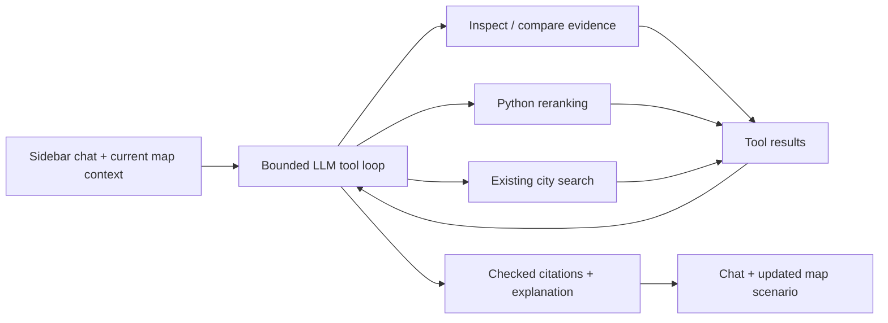

# Agentic PowerShift assistant

Implemented in the isolated `codex/llm-pipeline` worktree. This adds a tool-using LLM to the right sidebar while retaining the Sites tab, 3D project view, equipment selection, and existing analysis pipeline.

## User flow

The assistant composer is the main request entry point. The initial Sacramento request, Try demo shortcut, and Run space analysis button also submit to the same conversation. Explicit location-based discovery requests repeat the search even when the location is already loaded. There is no independent browser call to the city-search endpoint. The agent uses the displayed planning preferences and invokes the existing city search as a tool; essential clarifications and failures remain in chat.

Ask a question about the current shortlist or selected site, compare sites, request a priority/constraint change, or ask for a new US city search. The assistant can chain tool calls, displays its action status, and returns an explanation with checked source links and selectable site cards. Successful scenarios update the map and planning controls together. Switching sites, changing the current analysis, or pressing Stop cancels the active conversation turn.

Examples:

- “Compare the top two sites and explain their limitations.”
- “Set grid priority to 80 and keep the other preferences unchanged.”
- “Require existing developed land and rerank the shortlist.”
- “Find five solar rooftops in Davis, CA.”

## Implemented plan

1. A server-side Responses API loop interprets the request and chooses tools.
2. Validated tools read current evidence, inspect sites, compare measurements, rerank cached observations, or invoke the existing city search pipeline.
3. Python retains responsibility for scoring, constraints, capacity and generation calculations, and historical operating evidence. The LLM does not train or alter the ML model.
4. Structured replies reference IDs from the current evidence. Unknown citations are rejected and repaired within the same bounded loop.
5. SSE delivers action progress and the final result. The client applies a changed scenario only after a successful completed response.



The five tools are `get_analysis`, `inspect_sites`, `compare_sites`, `rerank_sites`, and `search_sites`. This is one agent coordinating tools; it is not a set of independently running specialist agents.

## Configuration and isolated development

Set `OPENAI_API_KEY` in the backend environment. `OPENAI_CHAT_MODEL` optionally selects a separate chat model; otherwise it uses `OPENAI_MODEL`, then `gpt-6-astra`. Astra uses low reasoning effort and an 8,192-token output ceiling including reasoning. Overrides must support Responses function calling and strict structured output. Credentials remain server-side. Conversation history and compact analysis evidence are sent to OpenAI with `store: false`.

For simultaneous development, start the API from this worktree with its own cache and port:

```powershell
$env:CACHE_DIR='.cache/assistant-dev'
python -m uvicorn backend.main:app --host 127.0.0.1 --port 8013 --reload
```

In another terminal in the same worktree:

```powershell
$env:POWERSHIFT_API_URL='http://127.0.0.1:8013'
npm run dev -- --port 5182
```

Configure live dataset paths/services as described in the project README. Without an OpenAI key the chat reports its unavailability; it does not simulate an AI answer. Existing loaded site details and saved scenarios remain available; new searches require the assistant connection.

## Behavior and limits

- Maximum seven model rounds, eight tool actions, one new search per message, and a five-minute request deadline. The client sends at most twelve prior messages. Conversation history is currently in memory and clears on reload.
- Reranking creates a new run ID and preserves the original cached analysis. Requested changes are partial patches; other preferences remain intact. New-city searches retain current weights, constraints, target (unless specified), and operating-evidence settings when ranking the collected observations.
- Search uses the existing provider pipeline. Regional scope is currently 40 km; automatic solar/wind comparison requires regional scope. Urban surface filters apply to solar. Rankings cover the pipeline's sampled observations, not every possible location.
- New scenario IDs are saved only after a validated final answer. A new search may already have populated its normal pipeline cache before cancellation or model failure; cancellation prevents the client from replacing the displayed map.
- Tool arguments, numeric bounds and IDs are validated. The assistant cannot invoke arbitrary code or disable protected-area exclusions through its tools. Citation validation checks identity, not the semantic truth of every sentence; explanations still require judgment.
- No project-economics optimization, permitting decisions, live interconnection capacity checks, or new-site generation forecasts from the historical ML study. A reported zero grid distance is a screening proxy.
- API authentication and multiuser quotas remain outside this feature; the application is intended for the existing single-user localhost setup.

## Verification

Backend coverage includes chained tools, real comparison calculations, immutable original scenarios, invalid arguments, citation repair, current UI preferences, search validation and preference preservation, service failure, action limits, and SSE. Frontend tests cover fragmented UTF-8/SSE, error propagation, initial/main-bar submissions through the real chat component, map updates, missing-key behavior, cancellation of late results, and deliberate repeated submissions. jsdom is a development-only test dependency.

The complete backend suite passed after the final change (191 passed, five artifact-dependent skips), including all 19 assistant tests. All 68 frontend tests and the production build passed. Browser verification used a real OpenAI key against an isolated API/cache with a saved analysis snapshot replayed for initial loading: comparison returned checked sources, grid priority 80 changed scores from 82.6 to 89.1, and a cited site opened its 3D details. Desktop and 390px mobile layouts were inspected. The main-search follow-up was also exercised with the real LLM and a replayed search-tool result from that saved analysis. It invoked search_sites and updated the map and conversation. New external-data collection was not executed in this preview; dispatch and preference preservation are covered by tests.

## Handoff

Changes are confined to the assistant module/tests, its endpoint in `backend/main.py`, the sidebar integration in `src/App.tsx`, new chat/SSE components and styling, optional chat-model configuration, and the optional Vite API proxy override. There are no training, ML artifact, or shared-cache changes. Integrate this branch when the main task is ready; preserve any newer parallel edits in `App.tsx` and `main.py` when resolving conflicts.
